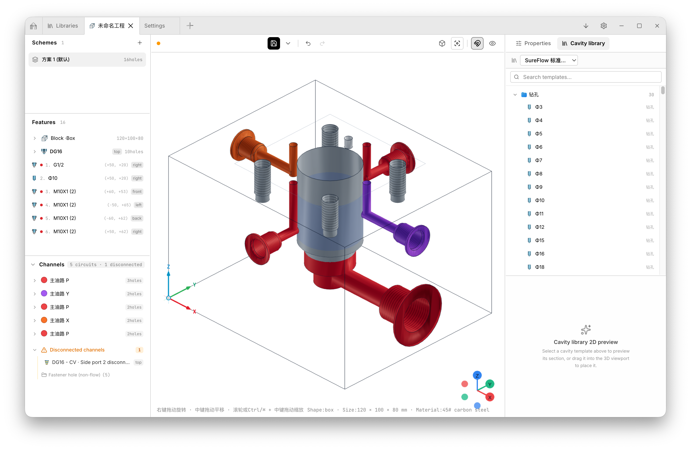
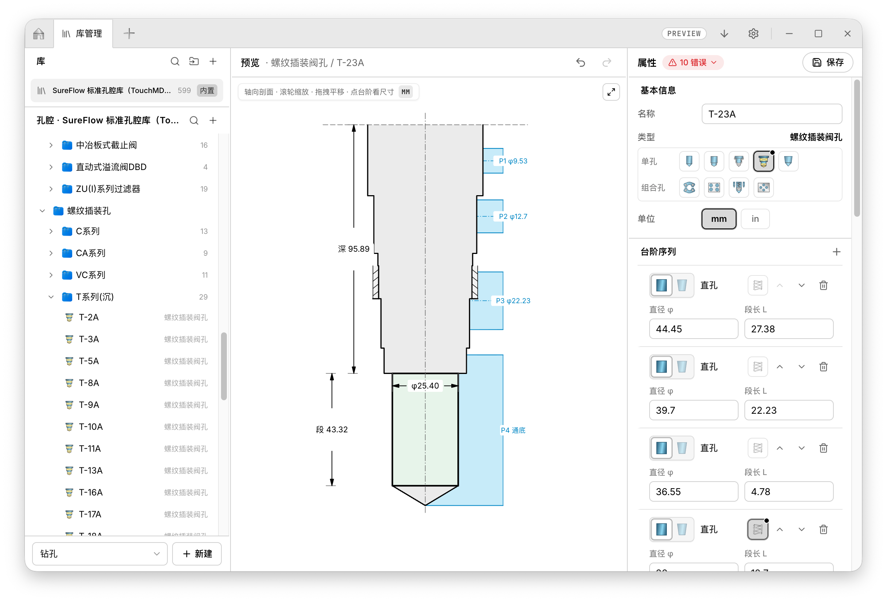

# SureFlow · Hydraulic Valve Block Design Software

English | [简体中文](./README.zh.md)

An independent desktop application dedicated to providing a professional and lightweight 3D design experience for hydraulic valve blocks (manifolds).

> [!WARNING]
> ⚠️ **WARNING: Currently under active development — DO NOT use in production!**
> Core features, data structures, and algorithms are undergoing rapid iteration and changes.

>  
>  

## ⚡ Extreme Performance

Our highly optimized Constructive Solid Geometry (CSG) engine guarantees smooth interactions even under extreme conditions:
- **Massive Geometry Creation**: Builds 1,000 cavities from scratch in just **188 ms**.
- **Extreme Stress Testing**: Computes 10,000-cavity boolean differences (over 660,000 triangular faces) in just **4.7 seconds** with a 100% success rate.
- **Instant Interaction**: Tweak single cavities with a response time of **≤ 45 ms** for immediate visual feedback.
- **Zero Memory Leaks**: Advanced WASM memory management ensures **0 leaks** during prolonged usage.

## ✨ Core Features

SureFlow currently provides the following foundational capabilities for a smooth design and preview experience:

- **Comprehensive Cavity Library**: A rich and standard cavity library that allows users to quickly place and manage various hydraulic cavities.
- **Flow Path & Hole Modeling**: Advanced hydraulic flow path design, counterbore/thread configuration, and parametric editing of hole depth/distance.
- **3D Real-time Rendering & Interaction**: Supporting orbit controls (rotate/pan/zoom), soft shadows, grid floor, and Gizmo axes indicator.
- **Parametric Valve Block Model**: Pure data-driven parametric components, supporting hexahedron body, standard ports (P/T/A/B), M10 mounting holes, and translucent flow paths.
- **Industrial Format Export**: Export to standard industrial formats (STEP, STL) for seamless CAD/CAM integration.
- **Project File Management**: Comprehensive local project file management (new, open, save) and application packaging for distribution.
- **Professional CAD UI**: Light professional CAD style UI, classic three-panel layout (Toolbar / 3D Viewport / Status bar), and standard view presets (Perspective/Top/Front/Right).
- **Secure Desktop Architecture**: Three-process architecture separating main process, preload script, and renderer, utilizing the `contextIsolation` security model.

## 🚀 Roadmap

In upcoming versions, SureFlow will deeply enhance **engineering design** capabilities:

- [ ] **CAD Software Integration**: Seamless integration with industry-standard software like Solidworks, Creo, and UG.
- [ ] **AI-Powered Features**: AI-assisted fast filtering from the cavity library, intelligent layout generation, and layout export.
- [ ] **Hydraulic Calculations**: Built-in calculation tools for hydraulic characteristics and system logic.
- [ ] **Interference Check & Analysis**: Smart internal interference checks, advanced section views, and precise measurement tools.
- [ ] **System Tray Support**: Background running and quick access via the system tray.
