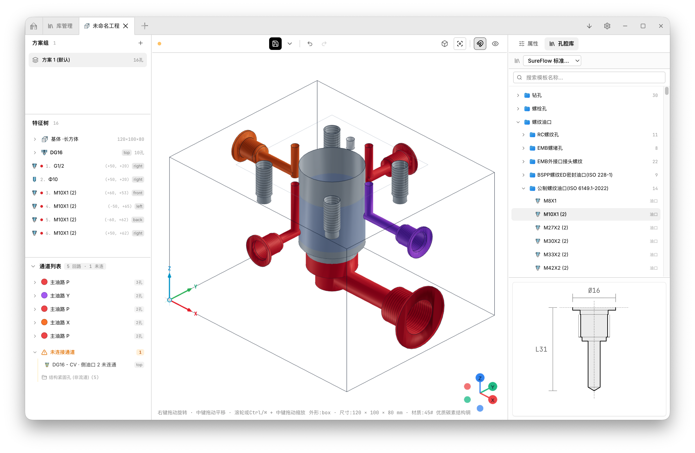

# SureFlow · 液压阀块设计软件

[English](./README.md) | 简体中文

一款独立桌面应用，专注于提供专业、轻量级的液压阀块（集成块）三维设计体验。

> [!WARNING]
> ⚠️ **警告：本项目当前处于积极开发阶段，请勿用于生产环境！**
> 核心功能、数据格式与算法仍在持续迭代与调整中。

>  
>  

## ⚡ 极限性能 (Extreme Performance)

通过高度优化的构造实体几何 (CSG) 引擎，在极限条件下依然保证流畅交互：
- **海量特征极速构建**：从零构建 1,000 个孔腔仅需 **188 ms**。
- **万级布尔极限抗压**：10,000 孔极限差集运算（超 66 万三角面）仅耗时 **4.7 秒**，成功率 100%。
- **毫秒级单孔交互**：单孔微调响应时间 **≤ 45 ms**，真正实现拖拽实时预览。
- **零内存泄漏**：基于先进的 WASM 内存管理，在长时操作下保持 **0 泄漏**。

## ✨ 核心特性

SureFlow 目前已具备以下基础能力，为您提供流畅的设计与预览体验：

- **海量标准孔腔库**：内置丰富标准的孔腔特征库，支持快速调取与排布液压孔腔。
- **流道与孔道建模**：深度支持复杂的液压流道设计、沉孔/螺纹配置、以及孔深孔距的参数化精准编辑。
- **3D 实时渲染与交互**：支持轨道控制（旋转/平移/缩放）、软阴影、网格地面与坐标轴指示器（Gizmo）。
- **参数化阀块模型**：纯数据驱动的参数化组件，支持六面体本体、P/T/A/B 等标准油口以及 M10 安装孔，孔道支持半透明显示。
- **工业格式导出**：支持导出标准工业格式（如 STEP, STL），无缝衔接其他 CAD/CAM 制造软件。
- **工程文件管理**：完善的本地工程文件管理，支持新建、打开与保存，以及应用打包分发。
- **专业 CAD 界面**：采用浅色专业 CAD 风格 UI，经典的三段式布局（工具栏 / 3D视口 / 状态栏），提供标准视图预设（透视/俯视/主视/右视）。
- **高安全性桌面架构**：采用主进程、预加载脚本与渲染进程分离的三进程架构，配合 `contextIsolation` 安全模型。

## 🚀 未来规划 (Roadmap)

在后续的版本中，SureFlow 将深入强化**工程设计**方面的能力：

- [ ] **商用 CAD 集成**：实现与 Solidworks、Creo、UG 等主流 CAD 软件的深度集成。
- [ ] **前沿 AI 特性**：引入 AI 辅助功能，实现快速从孔腔库中筛选、智能布局生成与自动导出等功能。
- [ ] **专业液压计算**：内置液压特性计算、压降模拟分析与系统逻辑验算。
- [x] **干涉检查与分析**：提供智能的内部孔道干涉检查，以及高级剖切视图和精确测量工具。
- [x] **系统托盘支持**：支持后台常驻，通过系统托盘实现快捷访问。